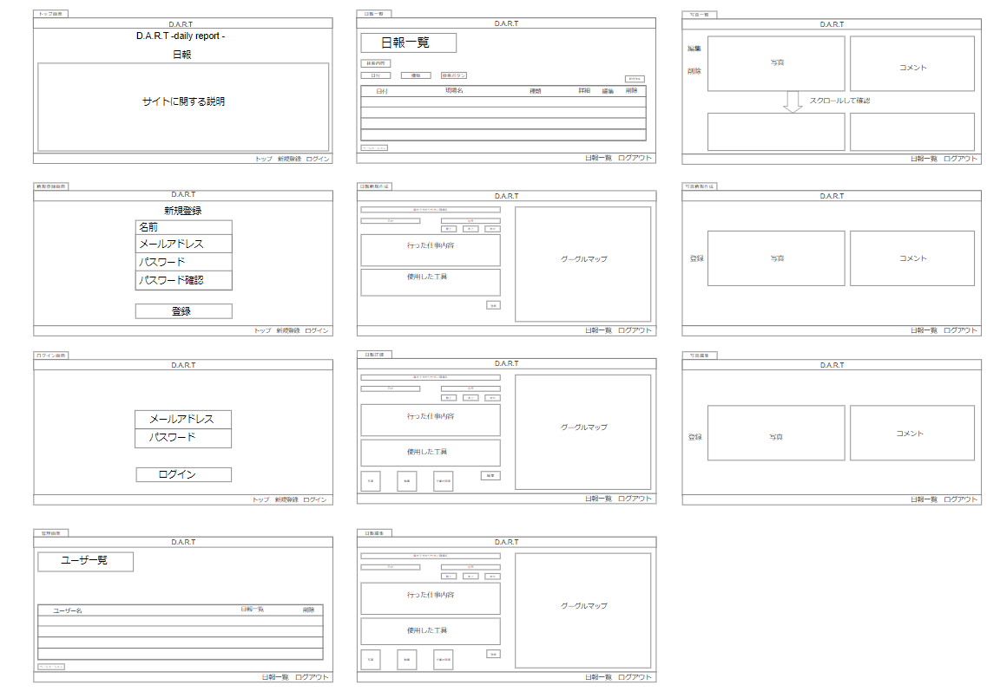
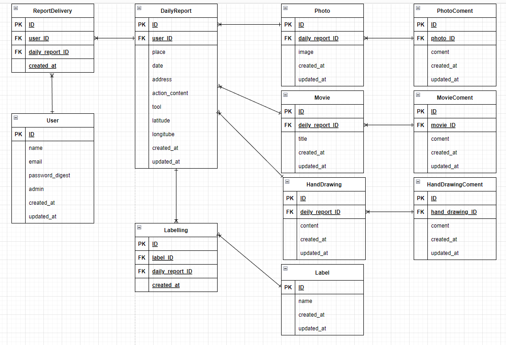
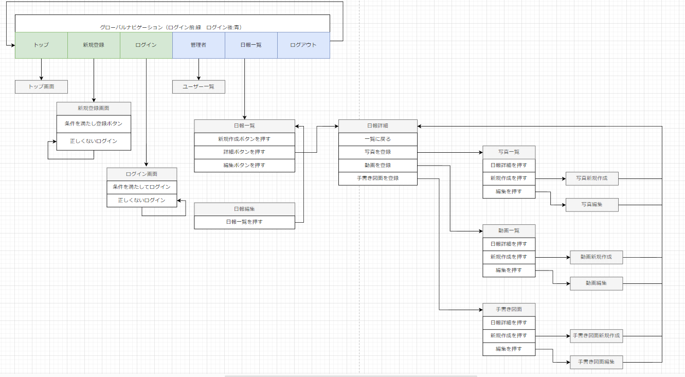

# README

# 開発言語
* Ruby3.0.1
* Rails6.1.6

<br>

# 就職Termの技術

* AWS EC2
* Ajaxを使ったコメント機能


<br>

# カリキュラム外の技術
* Active Storage
* geocoder
* googlemap

<br>

# 実行手順
```
$ git clone git@github.com:meships/daily_report.git
$ cd original_app
$ bundle
$ yarn install
$ rails db:create && rails db:migrate
$ rails s
```

<br>

# カタログ設計
https://docs.google.com/spreadsheets/d/1Ftd0K0ZemsrLSfDNt_jpvnnyRbiytbhF0Hzp1bsixzQ/edit#gid=782464957
<br>

# テーブル定義書
https://docs.google.com/spreadsheets/d/1Ftd0K0ZemsrLSfDNt_jpvnnyRbiytbhF0Hzp1bsixzQ/edit#gid=2020033787

<br>

# ワイヤーフレーム


<br>

# ER図


<br>

# 画面遷移図

